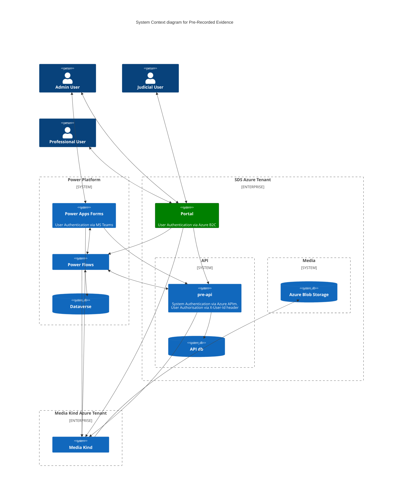

# pre-portal

# Pre-Recorded Evidence Portal.

[](https://opensource.org/licenses/MIT) [](https://sonarcloud.io/summary/new_code?id=pre-portal) [](https://sonarcloud.io/summary/new_code?id=pre-portal) [](https://sonarcloud.io/summary/new_code?id=pre-portal) [](https://sonarcloud.io/summary/new_code?id=pre-portal)

## Purpose

This code repository contains the source code for the Pre-Recorded Evidence Portal.

The Portal provides a secure interface for professional and judicial users to login, browse and watch recordings which have been shared with them.

This diagram gives an overview of the PRE system which the pre-portal connects to in its current state (not yet live).



## Related Repositories

- [PRE Power Platform Frontend](https://github.com/hmcts/pre-power-platform)
- [PRE Shared Infrastructure](https://github.com/hmcts/pre-shared-infrastructure)
- [PRE Function Apps](https://github.com/hmcts/pre-functions)
- [PRE API](https://github.com/hmcts/pre-api)

## Getting Started

### Prerequisites

Running the application requires the following tools to be installed in your environment:

- [Node.js](https://nodejs.org/) v12.0.0 or later
- [yarn](https://yarnpkg.com/)
- [Docker](https://www.docker.com)

### Running the application

Install dependencies by executing the following command:

```bash
yarn install
```

Bundle:

```bash
yarn webpack
```

Run:

```bash
yarn start
```

The applications's home page will be available at https://localhost:4551

### Running with Docker

Create docker image:

```bash
docker-compose build
```

Run the application by executing the following command:

```bash
docker-compose up
```

This will start the frontend container exposing the application's port
(set to `4551` in this template app).

In order to test if the application is up, you can visit https://localhost:4551 in your browser.
You should get a very basic home page (no styles, etc.).

## Developing

### Code style

We use [ESLint](https://github.com/typescript-eslint/typescript-eslint)
alongside [sass-lint](https://github.com/sasstools/sass-lint)

Running the linting with auto fix:

```bash
yarn lint --fix
```

### Running the tests

This template app uses [Jest](https://jestjs.io//) as the test engine. You can run unit tests by executing
the following command:

```bash
yarn test
```

Here's how to run functional tests (the template contains just one sample test):

```bash
yarn test:routes
```

Running accessibility tests:

```bash
yarn test:a11y
```

Make sure all the paths in your application are covered by accessibility tests (see [a11y.ts](src/test/a11y/a11y.ts)).

### Security

#### CSRF prevention

[Cross-Site Request Forgery](https://github.com/pillarjs/understanding-csrf) prevention has already been
set up in this template, at the application level. However, you need to make sure that CSRF token
is present in every HTML form that requires it. For that purpose you can use the `csrfProtection` macro,
included in this template app. Your njk file would look like this:

```

...
<form ...>
  ...
    {{ csrfProtection(csrfToken) }}
  ...
</form>
...
```

#### Helmet

This application uses [Helmet](https://helmetjs.github.io/), which adds various security-related HTTP headers
to the responses. Apart from default Helmet functions, following headers are set:

- [Referrer-Policy](https://helmetjs.github.io/docs/referrer-policy/)
- [Content-Security-Policy](https://helmetjs.github.io/docs/csp/)

There is a configuration section related with those headers, where you can specify:

- `referrerPolicy` - value of the `Referrer-Policy` header

Here's an example setup:

```json
    "security": {
      "referrerPolicy": "origin",
    }
```

Make sure you have those values set correctly for your application.

### Healthcheck

The application exposes a health endpoint (https://localhost:4551/health), created with the use of
[Nodejs Healthcheck](https://github.com/hmcts/nodejs-healthcheck) library. This endpoint is defined
in [health.ts](src/main/routes/health.ts) file. Make sure you adjust it correctly in your application.
In particular, remember to replace the sample check with checks specific to your frontend app,
e.g. the ones verifying the state of each service it depends on.

## License

This project is licensed under the MIT License - see the [LICENSE](LICENSE) file for details
